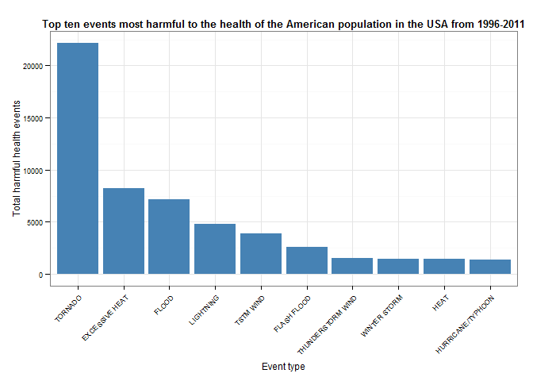
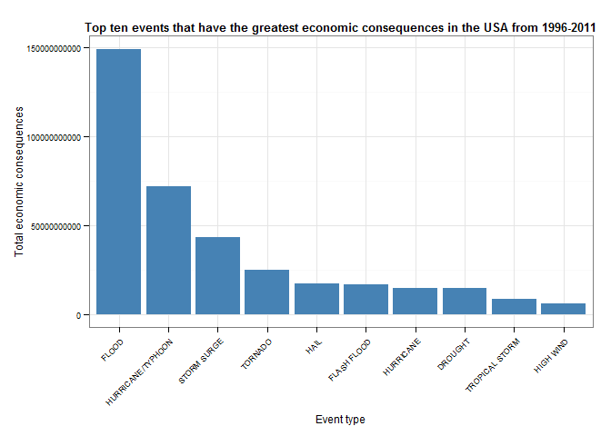

Impact of severe weather events on the USA population health and economy
------------------------------------------

### Synopsis

Storms can have a considerable effect human health as well as the economy. This 
project presents the types of storm related events that are responsible for most
negative affects in USA from 1996 to 2011.
 
Here we used the NOAA storm database to investigate which types of weather events
caused greatest harm to population health(fatalities and injuries) and  the most 
detrimental to the economy(property and crop damage) in the USA from 1996 to 
2011. The data processing and analysis were performed in R and Rstudio. We present
the ten most important weather event types causing human fatalities, injuries, 
property damage or crop damage. The tornado was found to have caused most fatalities
and injuries whereas floods caused the most property and crop damage.

### Introduction
Storms and other severe weather events can cause both public health and economic
problems for communities and municipalities. Many severe events can result in 
fatalities, injuries, and property damage, and preventing such outcomes to the 
extent possible is a key concern.

This project involves exploring the USA National Oceanic and Atmospheric 
Administration's (NOAA) storm database. This database tracks characteristics of 
major storms and weather events in the United States, including when and where 
they occur, as well as estimates of any fatalities, injuries, and property damage.

### Goals
The basic goal of this project is to explore the NOAA Storm Database and answer 
the next questions about severe weather events:

* Across the United States, which types of events are most harmful with respect
  to population health?

* Across the United States, which types of events have the greatest economic 
  consequences?

### Data Sources
The data for this project come in the form of a comma-separated-value file 
compressed via the bzip2 algorithm to reduce its size. You can download the file
from the course web site:

* [Storm Data](https://d396qusza40orc.cloudfront.net/repdata%2Fdata%2FStormData.csv.bz2) [47Mb]

There is also some documentation of the database available. Here you will find 
how some of the variables are constructed/defined.

* National Weather Service [Storm Data Documentation](https://d396qusza40orc.cloudfront.net/repdata%2Fpeer2_doc%2Fpd01016005curr.pdf)

* National Climatic Data Center Storm Events [FAQ](https://d396qusza40orc.cloudfront.net/repdata%2Fpeer2_doc%2FNCDC%20Storm%20Events-FAQ%20Page.pdf)

The events in the database start in the year 1950 and end in November 2011. In 
the earlier years of the database there are generally fewer events recorded, 
most likely due to a lack of good records. More recent years should be 
considered more complete.

### Setting up required environment in R

In the following code segment, we load the required packages in R and set the 
required global options.

```r
library(plyr)
library(ggplot2)
library(knitr)
opts_chunk$set(fig.path = 'figures/', fig.align = "center", echo=TRUE, comment = NA)
# Disabling scientific notation
options(scipen=999)
```

#### Changing locale time to English


```r
Sys.setlocale("LC_TIME", "english")
```

```
[1] "English_United States.1252"
```

#### Setting the working directory

Here we set the working directory as required, it can be changed according to 
your preference in your personal computer. In Windows you must be careful with 
the path, we can add or change the diagonal double forward slash in an inverted.
In linux there is no problem.


```r
setwd("C:\\Users\\admin\\Respaldo\\Coursera\\Reproducible Research\\RepData_PeerAssessment2")
```

### Data Processing

In this section the data is loaded into R and various operations are performed
on the data to shape the analysis.

#### Getting the required data

We get the required data set by downloading it, in case is not exist Data 
directory in the working directory, we use the following code segment to create it.


```r
dir.create("./Data", showWarnings = F)
```

Now we can download and load data set into R:


```r
if(!file.exists("./Data/stormdata.csv.bz2")){
  fileUrl <- "http://d396qusza40orc.cloudfront.net/repdata%2Fdata%2FStormData.csv.bz2"
  download.file(fileUrl, destfile = "./Data/stormdata.csv.bz2")
}

storm <- read.csv(bzfile("./Data/stormdata.csv.bz2"),
                  sep = ",", header = TRUE, stringsAsFactors = FALSE)
```

#### Data cleaning:

The previous data frame has the following structure.


```r
str(storm)
```

```
'data.frame':	902297 obs. of  37 variables:
 $ STATE__   : num  1 1 1 1 1 1 1 1 1 1 ...
 $ BGN_DATE  : chr  "4/18/1950 0:00:00" "4/18/1950 0:00:00" "2/20/1951 0:00:00" "6/8/1951 0:00:00" ...
 $ BGN_TIME  : chr  "0130" "0145" "1600" "0900" ...
 $ TIME_ZONE : chr  "CST" "CST" "CST" "CST" ...
 $ COUNTY    : num  97 3 57 89 43 77 9 123 125 57 ...
 $ COUNTYNAME: chr  "MOBILE" "BALDWIN" "FAYETTE" "MADISON" ...
 $ STATE     : chr  "AL" "AL" "AL" "AL" ...
 $ EVTYPE    : chr  "TORNADO" "TORNADO" "TORNADO" "TORNADO" ...
 $ BGN_RANGE : num  0 0 0 0 0 0 0 0 0 0 ...
 $ BGN_AZI   : chr  "" "" "" "" ...
 $ BGN_LOCATI: chr  "" "" "" "" ...
 $ END_DATE  : chr  "" "" "" "" ...
 $ END_TIME  : chr  "" "" "" "" ...
 $ COUNTY_END: num  0 0 0 0 0 0 0 0 0 0 ...
 $ COUNTYENDN: logi  NA NA NA NA NA NA ...
 $ END_RANGE : num  0 0 0 0 0 0 0 0 0 0 ...
 $ END_AZI   : chr  "" "" "" "" ...
 $ END_LOCATI: chr  "" "" "" "" ...
 $ LENGTH    : num  14 2 0.1 0 0 1.5 1.5 0 3.3 2.3 ...
 $ WIDTH     : num  100 150 123 100 150 177 33 33 100 100 ...
 $ F         : int  3 2 2 2 2 2 2 1 3 3 ...
 $ MAG       : num  0 0 0 0 0 0 0 0 0 0 ...
 $ FATALITIES: num  0 0 0 0 0 0 0 0 1 0 ...
 $ INJURIES  : num  15 0 2 2 2 6 1 0 14 0 ...
 $ PROPDMG   : num  25 2.5 25 2.5 2.5 2.5 2.5 2.5 25 25 ...
 $ PROPDMGEXP: chr  "K" "K" "K" "K" ...
 $ CROPDMG   : num  0 0 0 0 0 0 0 0 0 0 ...
 $ CROPDMGEXP: chr  "" "" "" "" ...
 $ WFO       : chr  "" "" "" "" ...
 $ STATEOFFIC: chr  "" "" "" "" ...
 $ ZONENAMES : chr  "" "" "" "" ...
 $ LATITUDE  : num  3040 3042 3340 3458 3412 ...
 $ LONGITUDE : num  8812 8755 8742 8626 8642 ...
 $ LATITUDE_E: num  3051 0 0 0 0 ...
 $ LONGITUDE_: num  8806 0 0 0 0 ...
 $ REMARKS   : chr  "" "" "" "" ...
 $ REFNUM    : num  1 2 3 4 5 6 7 8 9 10 ...
```

The variables which are of our interest:
```
 BGN_DATE   :   The event date
 EVTYPE     :   Type of weather events
 FATALITIES :   Event-related fatalities
 INJURIES   :   Event-related injuries
 PROPDMG    :   Property damage amount
 PROPDMGEXP :   Property damage units
 CROPDMG    :   Crop damage amount
 CROPDMGEXP :   Crop damage units
``` 

We need to reduce the table and only consider the variables that we will use:


```r
variables <- c("BGN_DATE", "EVTYPE", "FATALITIES", "INJURIES", "PROPDMG",
               "PROPDMGEXP", "CROPDMG", "CROPDMGEXP")
storm <- storm[, variables]
```

The variables, PROPDMGEXP and CROPDMGEXP has different values which we can 
observe from the following code segments.


```r
unique(storm$PROPDMGEXP)
```

```
 [1] "K" "M" ""  "B" "m" "+" "0" "5" "6" "?" "4" "2" "3" "h" "7" "H" "-"
[18] "1" "8"
```

```r
unique(storm$CROPDMGEXP)
```

```
[1] ""  "M" "K" "m" "B" "?" "0" "k" "2"
```

We transfer the EVTYPE, PROPDMGEXP and CROPDMGEXP to uppercase for aggregation.
We transfer the BGN_DATE to date time format.


```r
storm <- mutate(storm,
                EVTYPE     = toupper(EVTYPE),
                PROPDMGEXP = toupper(PROPDMGEXP),
                CROPDMGEXP = toupper(CROPDMGEXP),
                BGN_DATE   = as.Date(BGN_DATE, format="%m/%d/%Y %H:%M:%S")
                )
```

For PROPDMGEXP and CROPDMGEXP we see the following exponent values, here we have
decided to use the following strategy, from the variable descriptions in the 
codebook and some assumptions.

```
 '-' or '+' or ""  -  Leave PROPDMG as it is
 '0' - '7'         -  Multiply PROPDMG by 1eN i.e, 10^N where N belongs to {0, 1, 2, 3, 4, 5, 6, 7}
 'B'               -  Multiply PROPDMG by 1e9 i.e, 10^9
 'H'               -  Multiply PROPDMG by 1e2 i.e, 100
 'K'               -  Multiply PROPDMG by 1e3 i.e, 1000
 'M'               -  Multiply PROPDMG by 1e6 i.e, 10^6
 

 '?' or ""  -  Leave CROPDMG as it is
 '0'        -  Multiply CROPDMG by 1eN i.e, 10^N where N belongs to {0}
 'B'        -  Multiply CROPDMG by 1e9 i.e, 10^9
 'K'        -  Multiply CROPDMG by 1e3 i.e, 1000
 'M'        -  Multiply CROPDMG by 1e6 i.e, 10^6
```

We have to convert the input damage units to the same units to compute total 
damage, we did this with this function:


```r
decode <- function(u){
    switch(u, `-` = 1, `+` = 1, `?` = 1, ` ` = 1, `0` = 1, `1` = 10, `2` = 100, 
              `3` = 1000, `4` = 10000, `5` = 100000, `6` = 1000000, `7` =10000000,
              `8` = 100000000, `9` = 1000000000, B = 1000000000, H = 100, K = 1000,
               M  = 1000000, 0)
} 

storm$propertyDemage <- storm$PROPDMG * sapply(storm$PROPDMGEXP, decode)
storm$cropDemage     <- storm$CROPDMG * sapply(storm$CROPDMGEXP, decode)
```

Data prior to 1996 is only for tornado, thunderstorm, wind and hail events. From
1996 to present, 48 event types are recorded ([according to](http://www.ncdc.noaa.gov/stormevents/details.jsp),
only a subset of event types were monitored prior to 1996). We remove observations
before 1996 because of data incompleteness which may lead to biased results.


```r
storm <- storm[storm$BGN_DATE >= as.Date("01/01/1996", format = "%m/%d/%Y"), ]
```

Now we grouping by event type with the next code:


```r
report <- ddply(storm,
                .(EVTYPE),
                summarise,
                FATALITIES                    = sum(FATALITIES),
                INJURIES                      = sum(INJURIES),
                `PROPERTY DEMAGE AMOUNT`      = sum(propertyDemage),
                `CROP DEMAGE AMOUNT`          = sum(cropDemage),
                `TOTAL HARMFUL HEALTH EVENTS` = FATALITIES + INJURIES,
                `TOTAL ECONOMIC CONSEQUENCES` = `PROPERTY DEMAGE AMOUNT` + `CROP DEMAGE AMOUNT`,
                stringsAsFactors              = FALSE
               )
```

### Results

In this section, we will be analyzing the data we transformed and prepared in 
the previous section.

#### Most harmful to the health of the American population events

The NOAA Storm database has information about deaths and injuries caused by 
weather events. Here we analyze and report which ten weather events types were 
most harmful to human health.


```r
index <- with(report, order(`TOTAL HARMFUL HEALTH EVENTS`, decreasing=TRUE))
reportHarmfulHealthEvents <- report[index, c("EVTYPE", "FATALITIES", "INJURIES", "TOTAL HARMFUL HEALTH EVENTS")]
row.names(reportHarmfulHealthEvents) <- NULL
kable(head(reportHarmfulHealthEvents, 10), format = "pandoc", caption = "Top ten harmful health events")
```

```


Table: Top ten harmful health events

EVTYPE               FATALITIES   INJURIES   TOTAL HARMFUL HEALTH EVENTS
------------------  -----------  ---------  ----------------------------
TORNADO                    1511      20667                         22178
EXCESSIVE HEAT             1797       6391                          8188
FLOOD                       414       6758                          7172
LIGHTNING                   651       4141                          4792
TSTM WIND                   241       3629                          3870
FLASH FLOOD                 887       1674                          2561
THUNDERSTORM WIND           130       1400                          1530
WINTER STORM                191       1292                          1483
HEAT                        237       1222                          1459
HURRICANE/TYPHOON            64       1275                          1339
```

```r
plot1 <- ggplot(head(reportHarmfulHealthEvents, 10),
                aes(x=reorder(EVTYPE, -`TOTAL HARMFUL HEALTH EVENTS`), y=`TOTAL HARMFUL HEALTH EVENTS`)) +
         geom_bar(stat="identity", fill = "steelblue", binwidth = 5) +
         labs(title = "Top ten events most harmful to the health of the American population in the USA from 1996-2011",
              x     = "Event type",
              y     = "Total harmful health events") +
         theme_bw() +
         theme(plot.title   = element_text(lineheight=.8, size = 10, face  = "bold"),
               axis.text.x  = element_text(lineheight=.8, size =  7, angle = 45, hjust = 1),
               axis.text.y  = element_text(lineheight=.8, size =  7),
               axis.title.x = element_text(lineheight=.8, size =  9),
               axis.title.y = element_text(lineheight=.8, size =  9)
               )
print(plot1)
```



The Plot Bar Chart show events with the greatest harm to population health, as
defined by number of FATALITIES and INJURIES. We can see the most harmful weather
event is TORNADO.

#### Events that have the greatest economic consequences in the United States

Next, we asked which weather event types were most detrimental to the economy,
i.e. caused the largest property and crop damage.

Plot Bar Chart to show events with the greatest property damage:


```r
index <- with(report, order(`TOTAL ECONOMIC CONSEQUENCES`, decreasing = TRUE))
reportEconomicConsequences <- report[index, c("EVTYPE", "PROPERTY DEMAGE AMOUNT",
                                              "CROP DEMAGE AMOUNT", "TOTAL ECONOMIC CONSEQUENCES")]
row.names(reportEconomicConsequences) <- NULL
kable(head(reportEconomicConsequences, 10), format = "pandoc", caption = "Top ten economic consequences")
```

```


Table: Top ten economic consequences

EVTYPE               PROPERTY DEMAGE AMOUNT   CROP DEMAGE AMOUNT   TOTAL ECONOMIC CONSEQUENCES
------------------  -----------------------  -------------------  ----------------------------
FLOOD                          143944833550           4974778400                  148919611950
HURRICANE/TYPHOON               69305840000           2607872800                   71913712800
STORM SURGE                     43193536000                 5000                   43193541000
TORNADO                         24616945710            283425010                   24900370720
HAIL                            14595143420           2476029450                   17071172870
FLASH FLOOD                     15222203910           1334901700                   16557105610
HURRICANE                       11812819010           2741410000                   14554229010
DROUGHT                          1046101000          13367566000                   14413667000
TROPICAL STORM                   7642475550            677711000                    8320186550
HIGH WIND                        5247860360            633561300                    5881421660
```

```r
plot2 <- ggplot(head(reportEconomicConsequences, 10),
                aes(x=reorder(EVTYPE, -`TOTAL ECONOMIC CONSEQUENCES`), y=`TOTAL ECONOMIC CONSEQUENCES`)) +
         geom_bar(stat="identity", fill = "steelblue", binwidth = 5) +
         labs(title = "Top ten events that have the greatest economic consequences in the USA from 1996-2011",
              x     = "Event type",
              y     = "Total economic consequences") +
         theme_bw() +
         theme(plot.title   = element_text(lineheight=.8, size = 10, face  = "bold"),
               axis.text.x  = element_text(lineheight=.8, size =  7, angle = 45, hjust = 1),
               axis.text.y  = element_text(lineheight=.8, size =  7),
               axis.title.x = element_text(lineheight=.8, size =  9),
               axis.title.y = element_text(lineheight=.8, size =  9)
               )
print(plot2)
```



The plot show us, the weather event which have most economic impact across USA is FLOOD.

### Conclusion

Weather events that cause the greatest damage and casualties are tornado and 
flood. The authorities should approach these two types of damage differently.

### Future work

Explore the damage and casualties based on state and time attributes.


